Orion TVT Test Plan
========
##Author: Libing wang (libing_wang@ca.ibm.com)
##Revision: 1.0
##Date: May 19th, 2015

Overview
========
This test plan covers how to log into Orion as a specific TVT Tester (per language) and how to walk through the OrionUser Interface and pages checking for string translations and to see if those translations are accurate. 
While the common parts such as edit, setting and shell pages were already covered by the Orion TVT test plan 6.0, this version of the test plan only covers the git repository page and the global search panel as there are a lot of changes since the Orion 6.0 release.

#Part 1  Global Search
##GVT00010  Verify the display strings in the global search panel
In the editor page, press CTRL+SHIFT+H to bring up the global search panel. Verify the display strings as below.

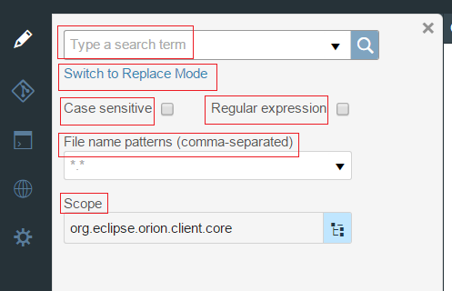

##GVT00020  Verify the display strings in the search result panel
In the search panel, type something to search so that it gives back some results. Verify display strings as below.

##GVT00030  Verify the tool tips in the search result panel
In the search panel, verify the tool tips stings as below.

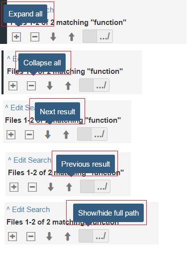

##GVT00040  Verify the display strings and tool tips in the replace mode
In the search result panel, click on "Edit Search" and then click on "Switch to Replace Mode". Verify the display strings and tool tips as below.

##GVT00050  Verify the display strings and tool tips in the replace preview panel
Type something to replace so that it gives back some results to preview. Verify the display strings and tool tips as below.

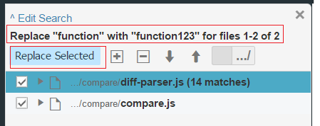

##GVT00060  Verify the display strings and tool tips in the replace result panel
In the preview mode panel, cleck on "Replace Selected". Verify the display strings and tool tips as below.

#part 2 - use git repository page to commit changes and test all the tooltips of the buttons.
### 2.1 Modify some files in the project and save them. Click on the "Git repository" button on the side bar of the page.###

### 2.2 The Git Repository page is opened as below. The left hand side of the page shows the project revision history while the right hand side shows the current changes.

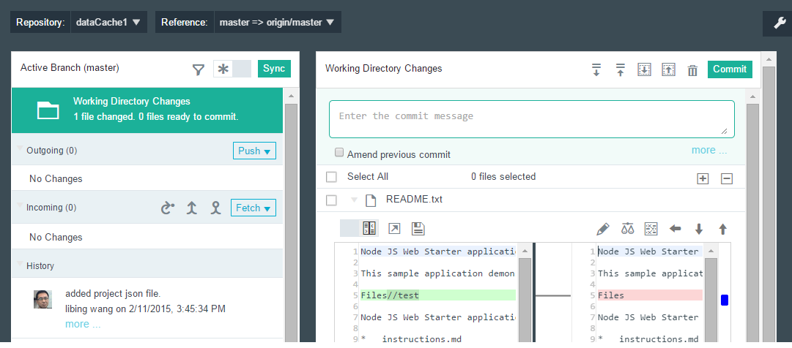

##TVT00080 - Verify the display strings on the left hand side of the page

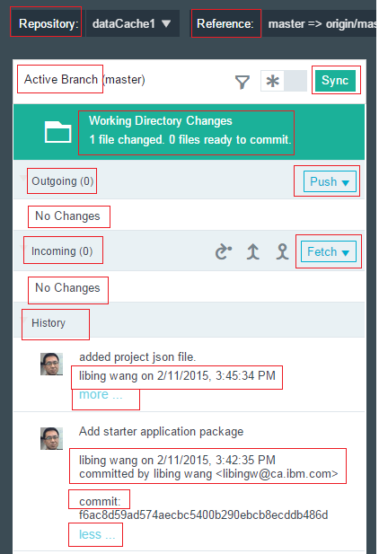

##TVT00090 - Verify the strings in the Repository dropdown panel
Click on the dropdown arrow on the right of the "Repository" label.

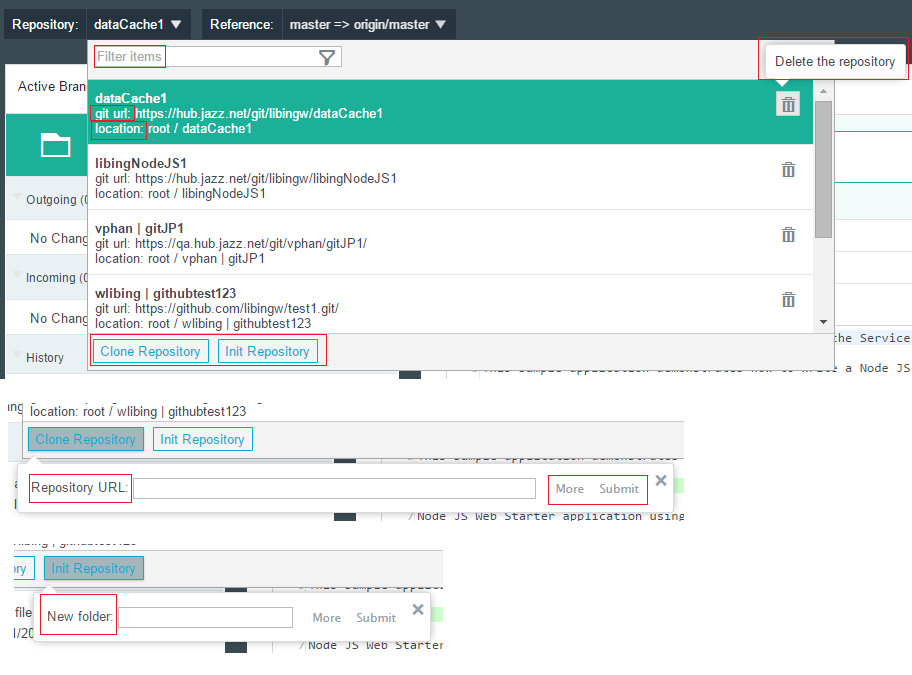

##TVT00100 - Verify the strings in the Reference dropdown panel
Click on the dropdown arrow on the right of the "Reference" label.

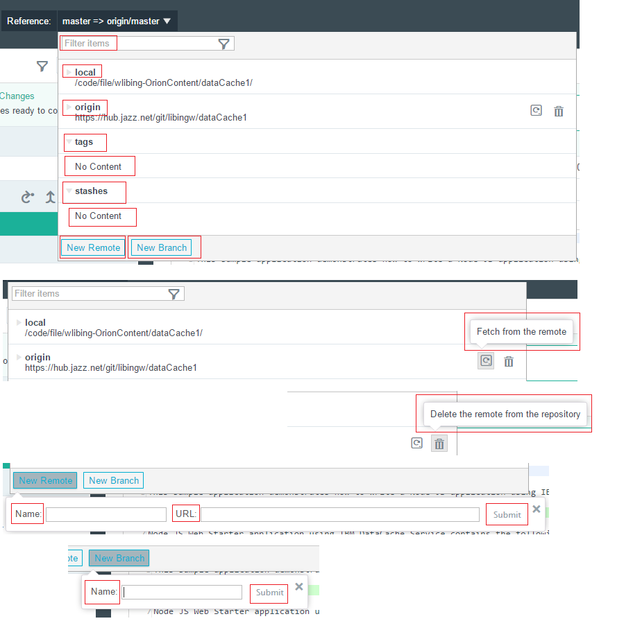

##TVT00100.01 - Verify the strings in the chekcout button from the reference dropdown panel
Click on the twistie on the local branch and hover on the checkot button.

##TVT00110 - Verify the strings of the tooltips on the left hand side of the page
Hover on buttons on the left hand side of the page

##TVT00110.01 - Verify the strings of the tooltips on the history button on the left hand side of the page
Click on the history button on the left hand side of the page. Hover on the history button again.

##TVT00120 - Verify the strings in the Push dropdown panel
Click on the dropdown arrow on the right of the "Push" button and hover on the 4 items in the dropdown list

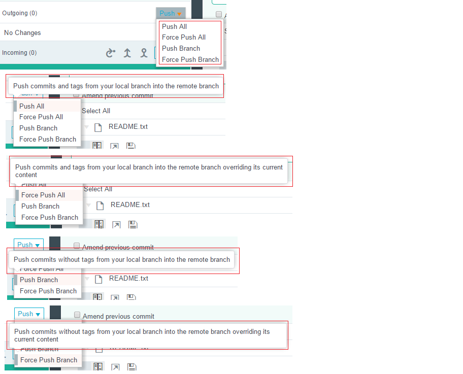

##TVT00130 - Verify the strings in the Fetch dropdown panel
Click on the dropdown arrow on the right of the "Fetch" button and hover on the 2 items in the dropdown list

##TVT00140 - Verify the display strings on the right hand side of the page

##TVT00140.01 - Verify the display strings and tooltips on the Git Configuration setting panel
Click on the wrench button on the right of the tool bar.

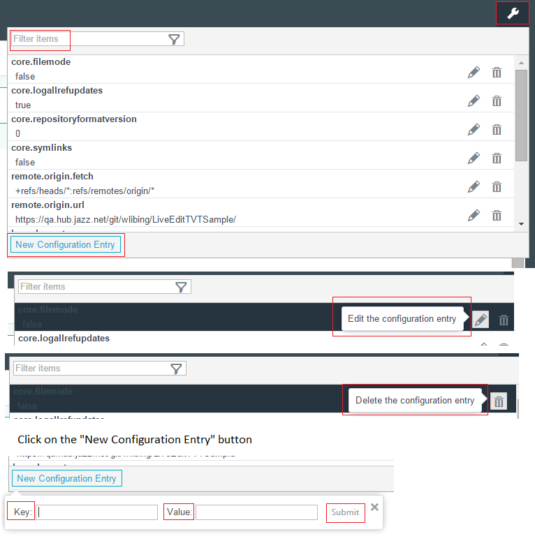

##TVT00150 - Verify the strings of the tooltips on the right hand side of the page
Hover on buttons on the right hand side of the page

##TVT00150.01 - Verify the strings of the tooltips on the right hand side of the page when a commit on the left hand side is selected
Click on a commit on the left hand side. Hover on buttons on the right hand side of the page

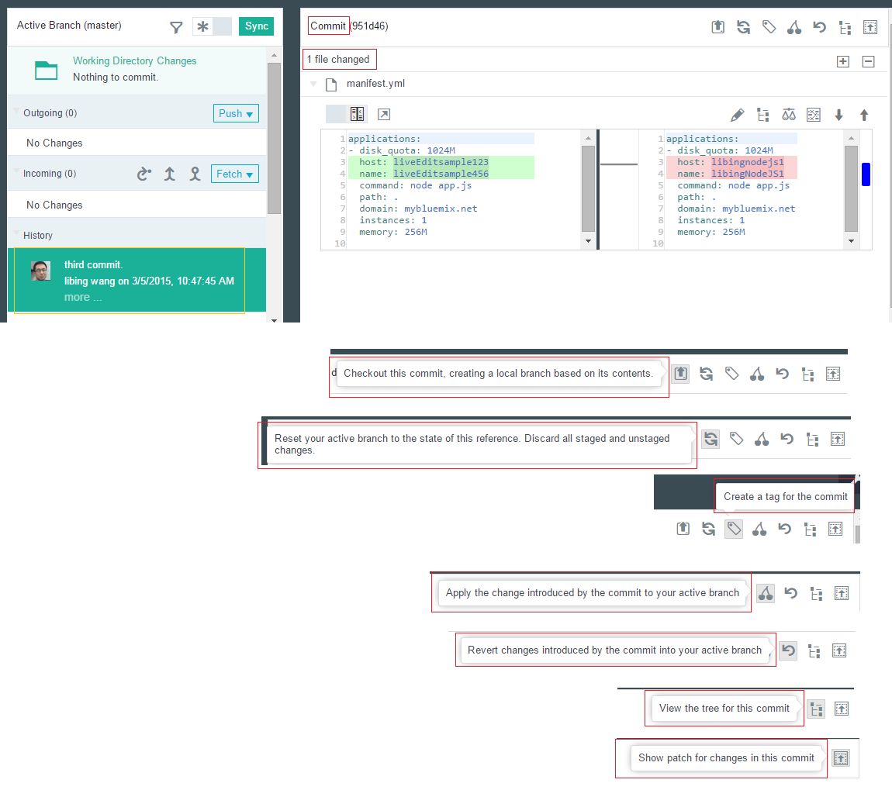

##TVT00150.02 - Verify the strings on the right hand side of the page when two commits on the left hand side are selected
Click on a commit on the left hand side. Then press CTRL key and click on the second commit.

##TVT00160 - Verify the strings of the tooltips on the compare section
Hover on buttons on the compare section of the page

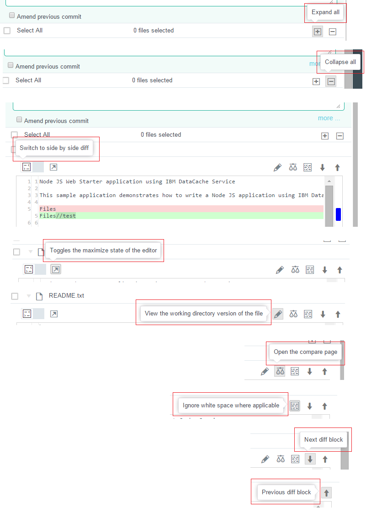

##TVT00170 - Verify the strings of the tooltips on the compare section in side by side mode
Click on the "Switch to side by side" button. Hover on buttons on the compare section of the page

