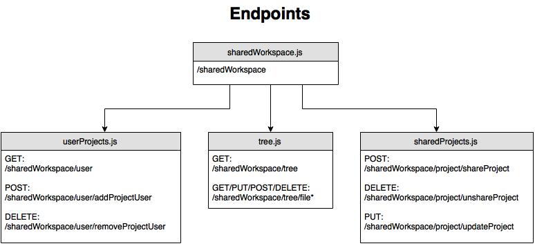
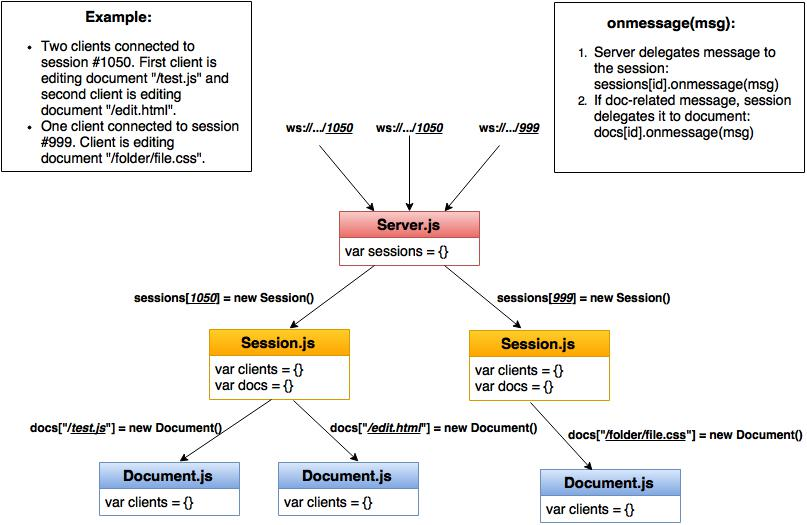

## Orion Collab

Collab mode includes a few components.
* [Server-side shared workspace][shared workspace]
* [Client-side collab (OT & shared workspace)][client side]
* [WebSocket Server][websocket server]
* [Authentication (using jwt)][auth]

### <a name="sw-section"></a>Server-side shared workspace implementation
Server component for loading a user's shared workspace content, for handling file system operations within the shared workspace and for interacting with the database. The following files are responsible for the work:

- 	***orionode/lib/sharedWorkspace.js***: Entry point for all shared operations.


- 	***orionode/lib/shared/tree.js***: Handles file operations originating from the shared workspace (GET/PUT/POST/DELETE files and folders).


- 	***orionode/lib/db/sharedProjects.js***: Database interface with the sharedProjects collection. Table includes list of shared projects with the users and hubID (unique project ID used for websocket connection).


- 	***orionode/lib/db/userProjects.js***: Database interface with the userProjects collection. Table includes orion users with list of shared projects they have access to.


- 	***orionode/lib/shared/sharedUtil.js***: Utility methods used by the shared workspace files.  


- 	***orionode/lib/shared/sharedDecorator.js***: Decorator that adds the hubID to the file metadata if its a shared project.



	TODO:
    1. Combine userprojects table with orionaccounts or at least check for user existence on invite.
    2. Better error handling for db queries.
    3. Since projects are uniquely identified by their path, if project gets deleted/renamed, cross-reference to database.
    4. Hub server api (tree/load tree/save) and file decorator (hub id) in single user mode

### <a name="cs-section"></a>Client-side collab (OT & shared workspace implementation)
As the editor loads (orion/ui/editorView.js), the collabClient is initialized ```new collabClient(editor, inputManager, fileClient)```. Once a project is selected, if it is a shared project, the client connects to the websocket with the project's hubID ```new WebSocket("ws://hubserver/hubID")``` and the collabClient starts catching and sending messages. Once a document is selected and the textView loads, the OT is started.

```
collab/web
│   README.md  
│   
└───collab
│   └───plugins
│       │   collabPlugin.html
│       │   collabPlugin.js
│
└───orion
│   └───collab
│		  │	shareProjectClient.js   Interface for requests to sharedWorkspace database endpoints (for invite/share project).
│   	  │	collabFileImpl.js       File client implementation for shared workspace (create/delete file, fetch children, etc).
│   	  │	collabSocket.js         Communication socket to hub server
│   	  │	ot.js                   OT library (third party, unmodified). Provides concurrent collaboration operations and a undo/redo stack.
|         | otAdapters.js           Adapter classes for OT to interact with Orion
│   	  │	collabClient.js         Entry point of client side collaboration feature
|         | collabFileAnnotation.js Collab file annotation used in file nav tree
|         | collabPeer.js           Collab peer class
|         | collabFileCommands.js   Defines "share/unshare" project commands

```


- ***collab/collabClient.js***: Main file for client-side collaboration. Takes in the editor and textView and makes things happen like annotations, prevent auto-save/auto-load, tree updates, etc. Handles doc-level messages (operations, selections, acknowledgement, etc), and starts the OT session.


	TODO: 
    1. Full UI for invite/share
    2. Single user mode collaboration
    3. (Bug) File operations from collab peers shouldn't close the current user's context menu
    4. Edit Selection to move along with the Undo stack
    5. Add quick progress screen/bar while connecting/authenticating to socket to give users context
    6. Progress screen while fetching document content
    7. Connect to socket directly after sharing a project, not just on project selection
    8. (Bug) Figure out how to deal with code folding and split window
    9. Handle socket failure (prevent non-owner from editing?)
    10. Add trigger to enable/disable shared mode
    11. Support MarkdownEditor
    12. Support local selection persistence

### <a name="ws-section"></a>WebSocket Server
Clients connect to the server with a session ID that represents the selected project. The WebSocket server has 3 layers and the messages flow in a single direction down the layers:

1. Server (main layer)
	* Websocket interface (entry point)
	* Handles new connections
	* Creates sessions based on session ID
	* Sends incoming messages down to appropriate session
2. Session (project layer)
	* Manages and keeps track of users currently within that session
	* Creates and and keeps track of active documents
	* Deals with session-level messages
	* Delegates doc-level messages down to the appropriate document
3. Document layer
	* Keeps track of users within that document
	* Loads document from the Orion server
	* Saves document to the filesystem through the Orion server
	* Makes use of OT and keeps latest version of file in memory
	* Deals with doc-specific messages (operation/selection/etc)



	TODO: 
    1. Make it easy to switch between WebSocket implementation (i.e. socketIO)
    2. Make generic send message method (related to point number 1)
    3. Give client notice if file load/save fails

### <a name="auth-section"></a>Authentication
A JSON webtoken is generated using a secret and including the username in the payload on user login. The token is saved in the browser local storage and sent to the websocket server upon connection. The websocket server decodes the token and ensures the person is infact an Orion user.
    
This requires that the Orion server (orion.conf) and WebSocket server (config file) both have the same JWT secret.


	TODO: 
    1. The socket server should send the decoded user to the orion server in order to ensure that the user is allowed to the particular project they are trying to access.
    2. Test for all authentication flows (github, google, etc.) 
    3. Let jwt be stored in httpOnly cookie instead of localStorage for security reason. This requires the ws server to run under the same domain as the orion server. The ws server can get the authentication token from the cookie in the ws handshake request. As a side effect, this also simplifies the authentication steps because the ws connection got authnticated as soon as the connection is established.

### Setting up Collab mode
1. Ensure the jwt secret is the same on both Orion and the WS Server.
2. Link the WS server to Orion by setting the Orion url in the config file.
3. Link Orion client to WS server by adding this in defaults.pref: "/collab": { "hubUrl": "YOUR_URL" }.
4. Add `./bundles/org.eclipse.orion.client.collab/web` to `append.static.assets` in `orion.conf`.
5. Add this endpoint at additional.endpoint in orion.conf: 
~~~json
{
    "endpoint": "/sharedWorkspace",
    "module": "./lib/sharedWorkspace",
    "extraOptions": {
        "root": "/sharedWorkspace/tree/file",
        "fileRoot": "/file"
    }
}
~~~
6. Enable `collab/plugins/collabPlugin.html` plugin by adding it to defaults.pref.
7. Run both servers.
8. Log in to Orion.
9. That's it :)

[shared workspace]: #sw-section
[client side]: #cs-section
[websocket server]: #ws-section
[auth]: #auth-section
